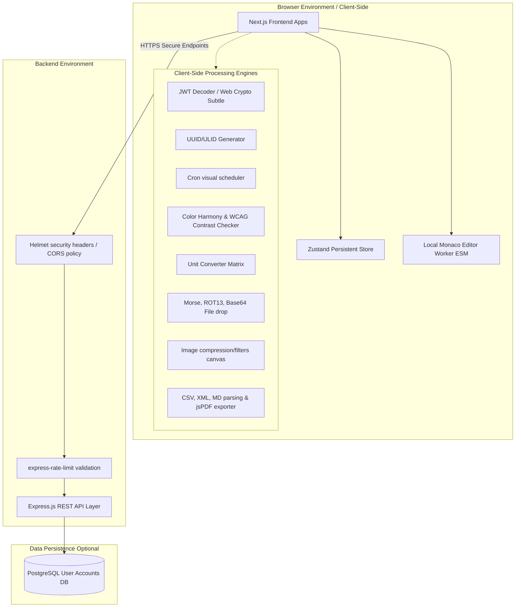

# DevChrono JSONLab

> Production-grade developer utility platform: **Epoch Converter** + **JSON Viewer/Formatter/Validator**

Fast, private, accurate. All core operations run client-side in the browser.

---

## Features

### Epoch Converter
- **Live Unix timestamp clock** — seconds, ms, µs, ns — auto-refresh every second
- **Timestamp → Date**: auto-detect unit, timezone support (IANA), ISO 8601, RFC 2822, UTC, Local
- **Date → Timestamp**: parse YYYY-MM-DD, MM/DD/YYYY, DD-MM-YYYY, ISO 8601, RFC 2822
- **Start/End calculator**: start/end of day, month, year in any timezone
- **Duration converter**: seconds ↔ days/hours/minutes/seconds
- **Code examples**: JavaScript, Python, Java, Go, PostgreSQL, MySQL, Linux shell
- **Nanosecond precision**: BigInt-safe
- **Keyboard shortcuts**: `C` to clear, `Ctrl+Enter` to convert
- **Persistent preferences**: unit, timezone, date format, 12/24h

### JSON Viewer
- **Monaco Editor** (VS Code engine) with JSON syntax highlighting and error markers
- **Interactive tree view**: collapsible nodes, type badges, array/key counts
- **Format / Minify / Validate** with exact error line/column
- **Copy path**: `$.user.name`, `user.address.city`
- **Advanced tools**:
  - JSON → TypeScript interface
  - JSON → CSV
  - JSONPath tester
  - Sort keys
  - Remove null values
  - Escape/unescape JSON string
- **Large file support**: up to 10 MB
- **Privacy**: 100% client-side, no data sent to server

---

## Architecture

```
apps/
  web/          Next.js 14 (App Router) + Tailwind + shadcn/ui
  api/          Express.js + TypeScript REST API
packages/
  shared/       Zod schemas, TypeScript types, utilities
docker/
  docker-compose.yml
  postgres/init.sql
```

### System Architecture Diagram



### Architectural Component Descriptions
- **Monorepo Layout**: The platform uses npm workspaces to isolate dependencies. Shared types, models, schemas, and helper libraries reside in `@devchrono/shared` and are loaded locally by the Next.js client (`@devchrono/web`) and the Express REST service (`@devchrono/api`).
- **Client-Side Execution Loop**: To guarantee maximum privacy, core formatters, viewer nodes, encoding converters, image canvas manipulation, and PDF document compilers run 100% in-browser. User configuration parameters are persisted locally inside the browser's `localStorage` via Zustand hooks.
- **REST Backend Service**: The REST backend handles auxiliary server workflows, secured using Helmet header policies, strict CORS origins configurations, and Express rate-limit configurations.

---

## Security Considerations

To ensure the safety of developer inputs, configurations, and secrets, the suite incorporates the following security design patterns:

### 1. Data Privacy & Zero-Transmission Policy
- **No Remote Operations for Sensitive Inputs**: None of the developer data (such as JWT payloads, private verification keys, configuration parameters, CSV contents, or YAML files) is ever transmitted to a server. All parser calculations are performed in-memory inside the browser tab context.
- **No Third-Party Analytics / Loggers**: Excludes external trackers, preventing key logs or data capture.

### 2. Sandbox Signature Generation via Web Crypto API
- Signature parsing for HS256/384/512 and RS256 algorithms is performed using the browser's native `window.crypto.subtle` Web Crypto APIs.
- Avoids arbitrary JS library compilations for cryptography, isolating keys from side-channel script vulnerabilities.

### 3. Local Monaco Editor ESM Config
- Monaco Editor contributions, languages, and workers are loaded locally from the project dependencies via ES Modules imports instead of resolving unverified scripts from public CDNs. This aligns with strict **Content Security Policy (CSP)** rules.

### 4. CSV Formula Injection Defense
- The CSV-to-JSON and JSON-to-CSV converters sanitize cell values containing formula triggers (such as `=`, `+`, `-`, `@`) by escaping them, preventing macro injection attacks when output sheets are opened in Microsoft Excel or Google Sheets.

### 5. API Layer Safeguards (Express Server)
- **Helmet Middleware**: Configures HTTP headers to protect against cross-site scripting (XSS), clickjacking, sniffing, and MIME-type vulnerabilities.
- **CORS Protection**: Access to REST endpoints is restricted to configured origins.
- **Rate-Limiting**: Prevents API abuse and DoS vectors using IP-based request throttles.

### Tech Stack

| Layer | Technology |
|-------|-----------|
| Frontend | Next.js 14, TypeScript, Tailwind CSS, shadcn/ui |
| Editor | Monaco Editor (@monaco-editor/react) |
| State | Zustand with localStorage persistence |
| Forms | React Hook Form + Zod |
| Toast | Sonner |
| Backend | Express.js + TypeScript |
| Security | Helmet, CORS, express-rate-limit |
| Logging | Winston (structured JSON in production) |
| Docs | Swagger/OpenAPI |
| Database | PostgreSQL (optional, for user accounts) |
| Cache | Redis (optional, for distributed rate limiting) |
| Container | Docker, docker-compose |

---

## Quick Start

### Prerequisites
- Node.js ≥ 18
- npm ≥ 9

### Development

```bash
# Clone the repo
git clone <repo-url>
cd devchrono-jsonlab

# Install all dependencies
npm install

# Copy environment files
cp .env.example .env
cp apps/api/.env.example apps/api/.env
cp apps/web/.env.local.example apps/web/.env.local

# Start both frontend and backend
npm run dev
```

- **Frontend**: http://localhost:4001
- **Backend API**: http://localhost:3001
- **API Docs**: http://localhost:3001/docs

### Build for Production

```bash
npm run build
npm start
```

---

## Docker

### Start all services (API + Web)

```bash
docker-compose -f docker/docker-compose.yml up -d
```

### With Redis + PostgreSQL

```bash
docker-compose -f docker/docker-compose.yml --profile full up -d
```

### Build individual images

```bash
# API
docker build -f apps/api/Dockerfile -t devchrono-api .

# Web
docker build -f apps/web/Dockerfile -t devchrono-web .
```

---

## API Reference

All endpoints return `application/json`.

### Health

```
GET /health
```
Returns service status, version, uptime.

### Time Endpoints

```
GET  /api/time/current          Current timestamp in all units
POST /api/time/convert          Timestamp → readable date
POST /api/time/from-date        Date string → timestamps
```

**POST /api/time/convert**
```json
{
  "timestamp": "1700000000",
  "unit": "seconds",           // optional, auto-detected
  "timezone": "America/New_York"
}
```

**POST /api/time/from-date**
```json
{
  "dateString": "2023-11-14T22:13:20Z",
  "timezone": "UTC"
}
```

### JSON Endpoints

```
POST /api/json/validate         Validate JSON
POST /api/json/format           Format/beautify JSON
POST /api/json/minify           Minify JSON
```

Full OpenAPI spec available at `/openapi.json` and `/docs`.

---

## Environment Variables

### apps/api/.env

| Variable | Default | Description |
|----------|---------|-------------|
| `PORT` | `3001` | Server port |
| `CORS_ORIGIN` | `http://localhost:4001` | Allowed CORS origins |
| `RATE_LIMIT_MAX_REQUESTS` | `100` | Requests per minute per IP |
| `RATE_LIMIT_JSON_MAX` | `30` | JSON endpoint rate limit |
| `BODY_LIMIT_DEFAULT` | `1mb` | Default body size limit |
| `BODY_LIMIT_JSON` | `10mb` | JSON endpoint body limit |
| `LOG_LEVEL` | `info` | Winston log level |
| `REDIS_URL` | — | Redis for distributed rate limiting |
| `DATABASE_URL` | — | PostgreSQL for user accounts |

### apps/web/.env.local

| Variable | Default | Description |
|----------|---------|-------------|
| `NEXT_PUBLIC_API_URL` | `http://localhost:3001` | Backend API URL |
| `NEXT_PUBLIC_APP_URL` | `http://localhost:4001` | Frontend URL |

---

## Testing

```bash
# Backend tests
npm test --workspace=apps/api

# Frontend unit tests
npm test --workspace=apps/web

# All tests
npm test

# With coverage
npm test -- --coverage
```

### Test Coverage

- Epoch conversion (seconds/ms/µs/ns)
- Timestamp auto-detection
- Date string parsing (5 formats)
- Edge cases: zero, negative, overflow, DST
- JSON validation, formatting, minification
- TypeScript/CSV generation
- Tree utilities

---

## Deployment

### Vercel (Frontend)

```bash
cd apps/web
npx vercel --prod
```

Set `NEXT_PUBLIC_API_URL` to your API URL in Vercel dashboard.

### Railway / Render (Backend)

Push to GitHub, connect repo to Railway/Render, set environment variables.

### AWS ECS Fargate

1. Push Docker images to ECR
2. Create ECS task definitions for API and Web
3. Deploy behind Application Load Balancer
4. Enable auto-scaling based on CPU/memory

See `DEPLOYMENT.md` for detailed AWS ECS guide.

---

## Security

- **Helmet** security headers (CSP, HSTS, etc.)
- **CORS** strict origin allowlist
- **Rate limiting** per IP (100 req/min default)
- **Body size limits** (1 MB default, 10 MB for JSON)
- **Input validation** with Zod schemas
- **No raw JSON logging** — only metadata logged
- **No server-side storage** of user data by default
- **XSS protection** via CSP headers
- **Dependency scanning** — run `npm audit` regularly

---

## Scaling

Designed for 100k+ monthly active users:

| Concern | Solution |
|---------|----------|
| CPU-intensive JSON parsing | Client-side (browser) |
| Large JSON files (>1MB) | Client-side with chunked processing |
| Rate limiting at scale | Redis-backed express-rate-limit |
| Static assets | CDN (CloudFront/Vercel Edge) |
| Backend scaling | Stateless Express + ECS Fargate autoscaling |
| Cache | Redis for session and rate limit state |
| Observability | Structured Winston logs → CloudWatch/Datadog |

---

## Production Checklist

- [ ] Set strong `CORS_ORIGIN` (no wildcards in production)
- [ ] Configure Redis for distributed rate limiting
- [ ] Enable HTTPS (TLS/SSL termination at load balancer)
- [ ] Set up log aggregation (CloudWatch, Datadog, etc.)
- [ ] Configure CDN for frontend static assets
- [ ] Set up health check monitors
- [ ] Enable WAF rules for the API
- [ ] Run `npm audit` and fix critical vulnerabilities
- [ ] Set `NODE_ENV=production`
- [ ] Disable API docs in production (`/docs`) if desired
- [ ] Configure database backups (if PostgreSQL enabled)
- [ ] Test with realistic traffic (k6 / Artillery)

---

## Contributing

1. Fork and clone the repo
2. Create a feature branch: `git checkout -b feat/my-feature`
3. Make changes following the code style
4. Add/update tests
5. Submit a PR

---

## License

MIT © DevChrono JSONLab


<!-- cp .env.example .env
cp apps/api/.env.example apps/api/.env
cp apps/web/.env.local.example apps/web/.env.local
npm install
npm run dev      # builds shared, starts API + web concurrently -->
