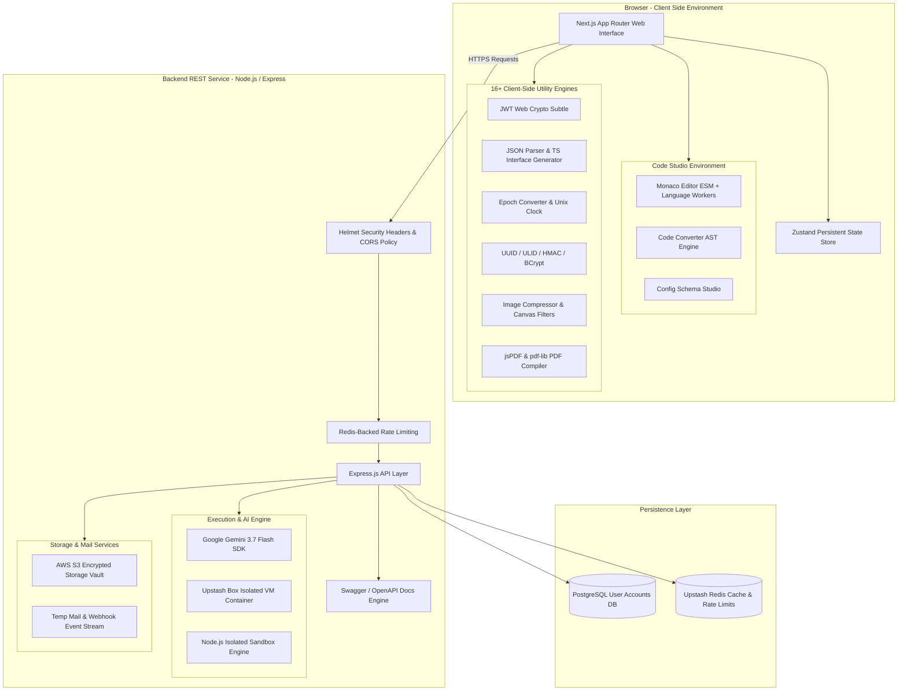

# DevKits — Developer Utility Platform & Code Studio

> **Production-grade, privacy-first developer workspace & utility suite**: Multi-language **Code Studio**, **Gemini AI Coding Assistant**, **Cloud Storage Vault**, **Temp Mail & Webhooks**, **JSON Viewer**, **JWT Decoder**, **Epoch Converter**, **Cron Generator**, and 16+ essential developer tools.

Fast, secure, offline-ready. Built with Next.js 14 App Router, Express.js, Monaco Editor, Upstash Box, and Google Gemini 3.7 Flash.

---

## 🌟 Key Platform Capabilities

### 1. 💻 Code Studio & Multi-Language Sandbox (`/code-studio`)
* **15+ Language Runtimes**: Execute TypeScript, JavaScript, Python, Go, Rust, C++, Java, PHP, Ruby, Bash, and SQL in an isolated sandbox environment.
* **VS Code-Grade Monaco Editor**: Multi-tab workspace, split editor views, syntax highlighting, bracket matching, custom themes (*Tokyo Night*, *OLED Black*), and per-language isolated undo/redo history.
* **Gemini 3.7 Flash AI Assistant**:
  * 📍 **4-Point Diagnostic Engine**: Identifies *Where the error is* (file & line), *Why it came* (root cause), *What's the solution*, and generates the *Apply Solution* code.
  * ✨ **1-Click IDE Auto-Fix**: Automatically reviews and applies AI-suggested code diffs directly into your editor.
  * 🎯 **Preset Action Modes**: *Clean Code*, *Explain Code*, *Generate Docs*, *Optimize Speed*, *Explain as Beginner (ELI5)*, *Fix Errors*, and *Generate Tests*.
* **Code Converter Studio**: Universal AST-powered & AI-assisted cross-language transpiler (e.g. Python ↔ TypeScript, Java ↔ Go, C++ ↔ Rust) with syntax cleanup and copy/paste tools.
* **Interactive Terminal & Stdin Stream**: Live standard output, ANSI-styled exit codes, interactive `stdin >` input bar with glowing prompts, and workspace execution locking.
* **Full Web API & Async Support**: Out-of-the-box support for `fetch`, `Headers`, `Request`, `Response`, `URL`, `URLSearchParams`, top-level `await`, and ES Module `import` statements.

---

### 2. 🧰 Developer Utility Suite (16+ Tools)
* **Formatters & Viewers**:
  * **JSON Viewer**: Format, validate, query (JSONPath), beautify, minify, generate TypeScript interfaces, and export to CSV.
  * **JWT Decoder**: Decode token payloads, verify HS256/RS256 signatures with Web Crypto, analyze claims, and re-sign tokens.
  * **Code Diff Checker**: Side-by-side and unified inline diffing with line-level change highlighting.
  * **HTML/CSS/JS Playground**: Live sandboxed browser playground with console interception.
* **Converters & Parsers**:
  * **Epoch Converter**: Live Unix epoch timestamp clock, date-to-timestamp and timestamp-to-date conversions with timezone offsets and duration math.
  * **Text Encoder / Decoder**: Base64, URL encoding, Hex, Binary, Morse Code, ROT13, and HTML entity converters.
  * **Universal Data Format Converter**: Real-time bi-directional mapping across CSV, XML, YAML, JSON, and Markdown.
  * **Case & String Utilities**: Camel, Pascal, Snake, Kebab, Constant case modifiers with character and syllable reading metrics.
* **Generators & Security**:
  * **Cron Expression Builder**: Visual schedule builder with human-readable English translations and next-execution time estimation.
  * **Key & Cryptography Suite**: Secure passwords, UUIDv4, sortable ULID, NanoID, HMAC hashing (SHA-256/512), and BCrypt generation.
  * **QR & Barcode Creator**: Custom styled vector QR codes and barcodes with SVG/PNG downloads.
  * **Lorem Ipsum & Mock Profiles**: Customizable placeholder sentences and realistic fake datasets (US/UK/IN/CA).
* **Calculators & Design**:
  * **Loan EMI & Salary Calculator**: Loan amortization schedules and Gross/Net income calculators.
  * **Currency Exchange**: Live currency conversion tables with simulated sparklines and offline mode.
  * **Unit Converter**: 10 measurement categories (Length, Mass, Temperature, Digital Data, Speed, etc.).
  * **Color Picker & WCAG Contrast**: HSL/RGB/CMYK palettes, triadic harmonies, and WCAG accessibility ratings.
  * **Image Compressor**: Client-side canvas compression, dimension scaling, and filters.
* **Network & PDF**:
  * **IP Geolocation**: Geolocation lookup, ISP mapping, and proxy/disposable flags.
  * **Speed Tester**: Real-time latency, jitter, download, and upload speedometer.
  * **PDF Utilities**: Client-side merge, split, watermark, and password protection.

---

### 3. 🔒 Cloud Storage Vault (`/storage`)
* **Encrypted File & Folder Vault**: S3-compatible cloud storage with multipart presigned uploads, client-side encryption, and directory trees.
* **Built-in Sticky Notes**: Rich-text markdown sticky notes with color coding, pin status, and auto-sync.
* **Secure Share Links**: Time-expiring, password-protected download links for files and folders.

---

### 4. 📬 Temp Mail & Webhook Hub (`/tempmail` & `/webhooks`)
* **Disposable Email Inboxes**: Real-time incoming email stream with live WebSocket/polling, attachments viewer, and auto-cleanup.
* **Webhook Inspector**: Catch and inspect incoming HTTP POST/GET payloads, headers, query parameters, and JSON bodies.

---

## 🏗️ System Architecture

```
apps/
  web/          Next.js 14 (App Router) + Tailwind CSS + shadcn/ui + Monaco Editor
  api/          Express.js + TypeScript REST API + Swagger/OpenAPI + Upstash Box SDK
packages/
  shared/       Zod validation schemas, shared TypeScript models, and utilities
docker/
  docker-compose.yml
  postgres/init.sql
```


```mermaid
graph TD
    subgraph Client [Browser - Client Side Environment]
        UI[Next.js App Router Web Interface]
        Store[Zustand Persistent State Store]
        
        subgraph CodeStudio [Code Studio Environment]
            Monaco[Monaco Editor ESM + Language Workers]
            Converter[Code Converter AST Engine]
            ConfigStudio[Config Schema Studio]
        end

        subgraph ClientTools [16+ Client-Side Utility Engines]
            JWT[JWT Web Crypto Subtle]
            JSONTool[JSON Parser & TS Interface Generator]
            Epoch[Epoch Converter & Unix Clock]
            Crypto[UUID / ULID / HMAC / BCrypt]
            Canvas[Image Compressor & Canvas Filters]
            PDF[jsPDF & pdf-lib PDF Compiler]
        end
    end

    subgraph Server [Backend REST Service - Node.js / Express]
        API[Express.js API Layer]
        Helmet[Helmet Security Headers & CORS Policy]
        RateLimiter[Redis-Backed Rate Limiting]
        Swagger[Swagger / OpenAPI Docs Engine]
        
        subgraph SandboxEngine [Execution & AI Engine]
            Gemini[Google Gemini 3.7 Flash SDK]
            Box[Upstash Box Isolated VM Container]
            NodeVM[Node.js Isolated Sandbox Engine]
        end

        subgraph StorageEngine [Storage & Mail Services]
            S3[AWS S3 Encrypted Storage Vault]
            TempMail[Temp Mail & Webhook Event Stream]
        end
    end

    subgraph Data [Persistence Layer]
        Postgres[(PostgreSQL User Accounts DB)]
        Redis[(Upstash Redis Cache & Rate Limits)]
    end

    UI --> Store
    UI --> CodeStudio
    UI --> ClientTools
    UI -- HTTPS Requests --> Helmet
    Helmet --> RateLimiter
    RateLimiter --> API
    API --> Swagger
    API --> SandboxEngine
    API --> StorageEngine
    API --> Postgres
    API --> Redis
```

---

## 🚀 Quick Start

### Prerequisites
* **Node.js**: ≥ 18.0.0
* **npm**: ≥ 9.0.0

### 1. Installation
```bash
# Clone the repository
git clone https://github.com/Sambit556/Dev-toolkit.git
cd Dev-toolkit

# Install all workspace dependencies
npm install

# Build shared package
npm run build --workspace=packages/shared
```

### 2. Environment Configuration
```bash
# Web application environment
cp apps/web/.env.local.example apps/web/.env.local

# Backend API environment
cp apps/api/.env.example apps/api/.env
```

Set your API keys in `apps/web/.env.local` and `apps/api/.env`:
```ini
# Google Gemini AI Key for Code Studio Assistant
GEMINI_API_KEY=your_gemini_api_key_here

# Upstash Box API Key (Optional for cloud micro-containers)
UPSTASH_BOX_API_KEY=your_upstash_box_key_here

# S3 Storage Vault (Optional for Cloud Storage Vault)
AWS_ACCESS_KEY_ID=your_aws_key
AWS_SECRET_ACCESS_KEY=your_aws_secret
AWS_S3_BUCKET=your_bucket_name
```

### 3. Running Locally
```bash
# Start both frontend (port 4001) and backend (port 3001) concurrently
npm run dev
```

* **Frontend Web App**: [http://localhost:4001](http://localhost:4001)
* **Code Studio**: [http://localhost:4001/code-studio](http://localhost:4001/code-studio)
* **Backend REST API**: [http://localhost:3001](http://localhost:3001)
* **Swagger API Documentation**: [http://localhost:3001/docs](http://localhost:3001/docs)
* **OpenAPI JSON Spec**: [http://localhost:3001/openapi.json](http://localhost:3001/openapi.json)

---

## 📖 API Documentation & Swagger

DevKits includes a comprehensive **OpenAPI 3.0** documentation suite accessible interactively at `/docs`.

### Key Endpoints

| Category | Method | Endpoint | Description |
| :--- | :--- | :--- | :--- |
| **Sandbox** | `POST` | `/api/sandbox/execute` | Execute code in isolated multi-language sandbox with stdin |
| **Sandbox** | `POST` | `/api/sandbox/ai` | Gemini 3.7 Flash AI code assist (explain, fix, clean, optimize, docs) |
| **Sandbox** | `POST` | `/api/sandbox/convert` | Universal source-to-target language code converter |
| **Sandbox** | `POST` | `/api/sandbox/share` | Create a shareable Code Studio workspace link |
| **Sandbox** | `GET` | `/api/sandbox/share/:id` | Retrieve a shared workspace project |
| **Sandbox** | `GET` | `/api/sandbox/metrics` | Sandbox health, supported language matrix, and resource caps |
| **Storage** | `GET` | `/api/storage/files` | List vault files and folders |
| **Storage** | `POST` | `/api/storage/upload` | Generate presigned S3 upload URL |
| **Auth** | `POST` | `/api/auth/register` | Register user account |
| **Auth** | `POST` | `/api/auth/login` | Authenticate user & issue encrypted JWT |
| **Email** | `GET` | `/api/tempmail/inbox` | Get temporary disposable inbox messages |
| **Webhook** | `POST` | `/api/webhook/inspect` | Capture and inspect HTTP payload |
| **System** | `GET` | `/health` | System health check and uptime |

---

## 🐳 Docker Deployment

### Start All Services (Web + API + Postgres + Redis)
```bash
docker-compose -f docker/docker-compose.yml --profile full up -d
```

### Build Individual Containers
```bash
# Build Backend API
docker build -f apps/api/Dockerfile -t devkits-api .

# Build Frontend Web App
docker build -f apps/web/Dockerfile -t devkits-web .
```

---

## 🧪 Testing & Verification

```bash
# Run backend API test suite
npm test --workspace=apps/api

# Run frontend unit tests
npm test --workspace=apps/web

# Verify TypeScript type checks across all workspaces
npm run build --workspace=packages/shared
npx tsc --noEmit --project apps/web/tsconfig.json
npx tsc --noEmit --project apps/api/tsconfig.json
```

---

## 🛡️ Security & Privacy

1. **Zero-Transmission Policy**: All sensitive developer utilities (JWT secrets, JSON trees, private RSA keys, CSV data) run entirely inside the client browser using Web Crypto Subtle APIs.
2. **Execution Sandboxing**: Server-side Code Studio execution runs inside isolated virtual machines with memory limits (256MB), execution timeouts, and strict buffer capping.
3. **Hardened Content Security Policy (CSP)**: Secure HTTP headers, strict origins CORS, and protection against XSS and clickjacking.
4. **Encrypted Authentication**: JWT claims and sessions are encrypted and rate-limited against brute force attacks.

---

## 📄 License

MIT License © 2026 DevKits Platform.
